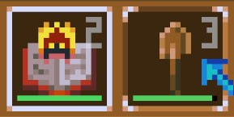
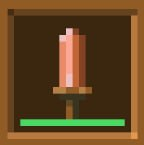
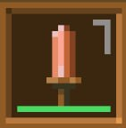
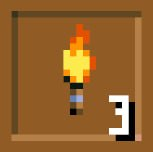
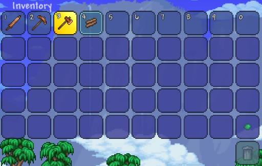

# Система Инвентаря (Inventory System)

## 1. Назначение

Управляет хранением, перемещением, использованием и сохранением предметов игрока. Инвентарь по умолчанию состоит из основной сетки 10x6 = 60 слотов. Первые 10 слотов — **хотбар**, всегда отображаются внизу экрана. Остальные 50 — основной инвентарь, видимый только при открытии окна.

---

## 2. Структура данных

### 2.1. `ItemStack` — содержимое одного слота

```gdscript
class ItemStack:
    var item_id: String              # ссылка на ItemBase.id
    var count: int = 0
    var durability: int = -1         # -1 = без прочности (будущее)
    var runes: Array[RuneData] = []  # установленные руны (Resource)
```

> **RuneData** — это отдельный Resource, который содержит тип руны, значение бонуса и т.д. Хранится в инвентаре как часть стека. Для инструментов и оружия слотов под руны может быть несколько (задаётся в ItemBase).

### 2.2. `InventoryData` — контейнер

```gdscript
class InventoryData:
    var slots: Array[ItemStack]        # размер = capacity
    var hotbar_indices: Array[int]     # индексы слотов хотбара (обычно 0..9)
    var selected_index: int = 0        # активный слот (в пределах хотбара)
    var capacity: int = 60             # может увеличиваться
    var trash_slot: ItemStack = null   # отдельный слот мусорки (Trash Slot)

    func get_hotbar_slot(index: int) -> ItemStack:
        return slots[hotbar_indices[index]]
```

**Важно:** расширение происходит путем добавления новых слотов кратно 10 в конец массива `slots`. Хотбар — всегда первые 10 слотов (индексы 0-9). Слот мусорки (`trash_slot`) хранится отдельно от массива основных слотов, чтобы при динамическом изменении ёмкости (например, с 60 до 70 слотов) мусорка всегда визуально и логически находилась в самом нижнем ряду инвентаря.

---

## 3. Менеджер инвентаря — `InventoryManager` (Autoload)

### 3.1. Публичные свойства

- `var data: InventoryData` — текущее состояние.
- `signal inventory_updated(slot_index: int, new_stack: ItemStack)`
- `signal trash_slot_updated(new_stack: ItemStack)`
- `signal selected_changed(new_index: int)`

### 3.2. Основные методы

#### `add_item(item_id: String, count: int) -> int`

Добавляет предметы в инвентарь. Возвращает количество реально добавленных (если не хватило места — остаток не добавляется, возвращается разница).

Алгоритм:

1. Получить `ItemBase` по ID.
2. Сначала ищем слоты с таким же ID и неполным стаком (приоритет: активный слот, затем хотбар слева направо, затем остальные).
3. Заполняем до `max_stack`, уменьшаем `count`.
4. Если `count > 0`, ищем первый пустой слот и создаём новый стек.
5. Если свободных слотов нет — возвращаем оставшееся количество.

#### `move_to_trash(slot_index: int)`

Перемещает предмет из указанного слота инвентаря в слот мусорки (`trash_slot`):

1. Если в `trash_slot` уже лежал предмет, он **безвозвратно удаляется** (уничтожается).
2. Предмет из `slot_index` переносится в `trash_slot`.
3. Слот `slot_index` становится пустым.
4. Излучаются сигналы `inventory_updated` и `trash_slot_updated`.

#### `restore_from_trash(to_index: int = -1)`

Забирает предмет из слота мусорки обратно в инвентарь (в указанный слот `to_index` или первый свободный).

#### `remove_item(slot_index: int, count: int) -> int`

Удаляет `count` предметов из указанного слота. Если слот пуст — возвращает 0. Если количество превышает наличие — удаляет все и возвращает фактически удалённое.

#### `move_item(from_index: int, to_index: int, split: bool = false, half: bool = false)`

Перемещает/объединяет/обменивает стеки.

- Если `from_index` пуст — ничего не делает.
- Если `to_index` пуст: перемещает весь стек (или половину/единицу, если задано).
- Если `to_index` содержит тот же ID и совместим по прочности/рунам: объединяет стаки.
- Если разные предметы: меняет местами (если не `split`/`half`).
- `split = true` — переносит ровно 1 единицу.
- `half = true` — переносит половину (округляет вверх).

#### `drop_active_stack(full: bool = true)`

Выбрасывает активный стек (выбранный слот хотбара).

- `full = true` — выбрасывает весь стек.
- `full = false` — выбрасывает только 1 единицу (Shift+G).
После выбрасывания создаётся объект в мире (ItemDrop) на позиции игрока.

#### `use_selected_item(target: Vector2, click_type: int)`

Вызывает использование активного предмета в зависимости от типа и клика (ЛКМ/ПКМ по миру или по блоку).

#### `sort_inventory()`

Сортирует все слоты основного инвентаря (начиная с индекса 10 и до конца). Хотбар (0-9) и мусорка остаётся нетронутыми.

#### `expand_capacity(extra_slots: int)`

Увеличивает ёмкость инвентаря на число, кратное 10 (например, +10 слотов). При этом визуальный интерфейс добавляет новую строку в сетку, а мусорка смещается вниз вместе с нижним слоем.

### 3.3. Обработка частичного перемещения (реализация сразу)

- При перетаскивании с зажатой правой кнопкой мыши (или Shift) в UI мы вызываем `move_item(from, to, split=false, half=true)` — переносим половину.  
- При перетаскивании с Ctrl — переносим одну единицу.  
- При клике правой кнопкой по слоту в открытом инвентаре — взять одну единицу (если есть) в активный слот. В Terraria: ПКМ по предмету в инвентаре — берёт половину стака в курсор (если курсор пуст). Мы реализуем аналогично: если курсор пуст, то при ПКМ по слоту берётся половина стака в "руку" (временный буфер). Пока можем упростить: ПКМ по слоту перемещает 1 единицу в активный слот хотбара (если активный слот пуст или совместим). Это будет удобно.

Для MVP реализуем:

- Drag-and-drop: обычный перенос всего стака, с зажатым Shift — перенос половины, с Ctrl — 1 единица.
- Клик ПКМ по слоту: взять 1 единицу в активный слот (если активный слот пуст или тот же предмет, иначе — ничего).

---

## 4. Сортировка инвентаря

Добавляем метод `sort_inventory()` в `InventoryManager`. Реализация:

1. Создаём список всех непустых стеков из слотов, начиная с индекса `HOTBAR_SIZE` (10) и до конца.
2. Сортируем по `ItemType` (приоритет: MATERIAL, BLOCK, TOOL, WEAPON, ...) и затем по `id` (алфавитно).
3. Заполняем отсортированными стеками слоты с индекса 10 и далее по порядку.
4. Остальные слоты (если слотов больше, чем стеков) заполняем пустыми.
5. Хотбар (0-9) не трогаем.

Кнопка сортировки размещается в UI инвентаря.

---

## 5. UI инвентаря

### 5.1. Визуальный стиль ячейки (`InventorySlot`)

Каждый слот представляет собой квадратный узел `InventorySlot` (`Control` / `PanelContainer` с фиксированным соотношением сторон 1:1) в классическом стиле Terraria:

- **Фон ячейки (Background):**
  - Квадратная полупрозрачная рамка/плитка.
  - Визуальное отличие хотбара: первые 10 слотов имеют отдельный стиль фоновой рамки (или постоянную видимость на HUD при закрытом инвентаре).
  - **Выделение (Selection Highlight):** активный слот хотбара подсвечивается яркой контрастной рамкой (белой).
  - **Hover**: при открытом инвентаре, при наведении показывается ховер с белыми уголками.
- **Иконка предмета (`TextureRect`):**
  - Располагается строго по центру ячейки со свободными отступами (padding).
  - Если слот пуст — текстура пустая (для слота мусорки отображается фоновая полупрозрачная иконка "мусорного бака").
- **Счётчик количества (`Label`):**
  - Отображается поверх иконки (обычно в правом нижнем или правом верхнем углу слота).
  - Текст с четким контуром (Outline) для читаемости на любом фоне.
  - Скрывается, если `count <= 1`.
- **Номер позиции предмета в хотбаре, от 1 до 0 (`Label`):**
  - Отображается поверх иконки (обычно в правом нижнем или правом верхнем углу слота).
  - Текст с четким контуром (Outline) для читаемости на любом фоне.
  - Скрывается, если `count <= 1`.
- **Индикатор / Полоска прочности (Durability Bar):**
  - Узкая шкала (`ProgressBar` или `ColorRect`) располагается **в самом низу ячейки**, во всю ширину слота.
  - Отображается **только если предмет подразумевает прочность** (`durability >= 0`).
  - **Цветовая индикация:**
    - Зелёный (100%–50%)
    - Жёлтый (49%–20%)
    - Красный (<20%)
    - Если предмет не имеет механики износа (`durability == -1`), полоска скрыта.

### 5.2. ПРИМЕРНОЕ дерево узлов `InventorySlot` (Godot Scene)

```text
InventorySlot (Control / PanelContainer)
├── SlotBackground (NinePatchRect / StyleBoxFlat)
├── ItemIcon (TextureRect) — Anchor: Center
├── SelectionBorder (ReferenceRect / Panel) — Подсветка активного хотбар-слота
├── StackLabel (Label) — Anchor: Bottom Right / Top Right
└── DurabilityBar (ProgressBar / Control) — Anchor: Bottom Wide
    └── Fill (ColorRect)
```

### 5.3. Структура окна инвентаря и механика Мусорки (Trash Slot)

- **Динамическая сетка:**
  - Основное окно содержит `VBoxContainer` или `GridContainer`.
  - Хотбар: 1 строка (10 слотов, индексы 0..9).
  - Основная сетка: N строк по 10 слотов (по умолчанию 5 строк, т.е. слоты 10..59).
  - При динамическом изменении ёмкости инвентаря (кратном 10) удаляется/добавляется новая строка из 10 слотов.

- **Расположение мусорки (Trash Slot):**
  - Слот мусорки располагается **в отдельной нижней панели управления** под основной сеткой инвентаря или привязан к **самой нижней правой части окна**.
  - **Правило позиционирования:** Слот мусорки **ВСЕГДА находится в самом нижнем слое/ряду UI**. При динамическом расширении сетки инвентаря на 10 слотов (добавлении нового ряда) слот мусорки автоматически смещается вниз, оставаясь на самом нижнем уровне под новым рядом.

- **Механика работы мусорки (Terraria-style):**
  - Помещение предмета в мусорку временное: предмет хранится в `trash_slot` до тех пор, пока туда не будет положен следующий предмет.
  - При помещении **нового** предмета в мусорку предыдущий находящийся там предмет **уничтожается навсегда**.
  - Игрок может в любой момент забрать предмет из мусорки обратно в инвентарь до того, как он перекроется новым.
  - Закрытие или очистка инвентаря **не очищает** мусорку (сохраняется последний положенный предмет).

### 5.4. Взаимодействие и управление

- **Выбор слота хотбара:** Колёсико мыши или клавиши `1`–`0`.
- **Drag-and-Drop:**
  - ЛКМ — взять весь стек в курсор / поместить стек.
  - Зажатый Shift + Перетаскивание — взять/перенести половину стака.
  - Зажатый Ctrl + Перетаскивание — взять/перенести 1 единицу.
  - Быстрое удаление: Shift + ЛКМ по предмету в инвентаре мгновенно отправляет его в слот мусорки.
- **Быстрый клик (ПКМ по слоту):**
  - Взять 1 единицу из слота в выбранную ячейку хотбара/курсор.
- **Выбросить предмет:**
  - Клавиша `G` — выбросить весь стек из выделенного слота.
  - `Shift + G` — выбросить 1 единицу.
  - Выбрасывание предмета мышью за пределы UI сетки в игровой мир.

### 5.5. Обновление UI

- При получении сигнала `inventory_updated(slot_index, new_stack)` обновляется соответствующий `InventorySlot`.
- При получении сигнала `trash_slot_updated(new_stack)` обновляется отображение слота мусорки.
- При вызове `selected_changed(new_index)` обновляется подсвечивающая рамка на хотбаре.

### 5.6. Примеры отображения слотов (UI Reference States)

<div align="center" style="display: flex; gap: 16px; flex-wrap: wrap; justify-content: center; margin-top: 16px;">

  <!-- 1. Выбранный активный предмет (белая рамочка) + hover (белые уголки) -->
  <figure style="border: 1px solid #333; border-radius: 8px; padding: 12px; background-color: #1e1e1e; width: 190px; display: flex; flex-direction: column; align-items: center; justify-content: space-between; margin: 0;">
    <div style="width: 100%; height: 120px; background-color: #121212; border-radius: 6px; display: flex; align-items: center; justify-content: center; overflow: hidden; padding: 4px; box-sizing: border-box;">
      
    </div>
    <figcaption style="margin-top: 10px; font-size: 12px; color: #ccc; text-align: center; width: 100%;">
      <strong style="color: #fff;">1. Активный предмет и Ховер</strong><br />
      Белая акцентная рамка выделения активного слота хотбара и эффект ховера.
    </figcaption>
  </figure>

  <!-- 2. Слот с полоской прочности -->
  <figure style="border: 1px solid #333; border-radius: 8px; padding: 12px; background-color: #1e1e1e; width: 190px; display: flex; flex-direction: column; align-items: center; justify-content: space-between; margin: 0;">
    <div style="width: 100%; height: 120px; background-color: #121212; border-radius: 6px; display: flex; align-items: center; justify-content: center; overflow: hidden; padding: 4px; box-sizing: border-box;">
      
    </div>
    <figcaption style="margin-top: 10px; font-size: 12px; color: #ccc; text-align: center; width: 100%;">
      <strong style="color: #fff;">2. Прочность (Durability)</strong><br />
      Цветовая полоска (зелёный/жёлтый/красный) внизу слота.
    </figcaption>
  </figure>

  <!-- 3. Слот в хотбаре с порядковым номером (1-0) -->
  <figure style="border: 1px solid #333; border-radius: 8px; padding: 12px; background-color: #1e1e1e; width: 190px; display: flex; flex-direction: column; align-items: center; justify-content: space-between; margin: 0;">
    <div style="width: 100%; height: 120px; background-color: #121212; border-radius: 6px; display: flex; align-items: center; justify-content: center; overflow: hidden; padding: 4px; box-sizing: border-box;">
      
    </div>
    <figcaption style="margin-top: 10px; font-size: 12px; color: #ccc; text-align: center; width: 100%;">
      <strong style="color: #fff;">3. Порядковый номер</strong><br />
      Цифра (1–0) в верхнем левом углу для слотов хотбара.
    </figcaption>
  </figure>

  <!-- 4. Счётчик количества предмета в слоте -->
  <figure style="border: 1px solid #333; border-radius: 8px; padding: 12px; background-color: #1e1e1e; width: 190px; display: flex; flex-direction: column; align-items: center; justify-content: space-between; margin: 0;">
    <div style="width: 100%; height: 120px; background-color: #121212; border-radius: 6px; display: flex; align-items: center; justify-content: center; overflow: hidden; padding: 4px; box-sizing: border-box;">
      
    </div>
    <figcaption style="margin-top: 10px; font-size: 12px; color: #ccc; text-align: center; width: 100%;">
      <strong style="color: #fff;">4. Счётчик стака</strong><br />
      Число предметов в правом углу (при count &gt; 1).
    </figcaption>
  </figure>

  <!-- 5. Референс инвентаря как в Terraria -->
  <figure style="border: 1px solid #333; border-radius: 8px; padding: 12px; background-color: #1e1e1e; width: 190px; display: flex; flex-direction: column; align-items: center; justify-content: space-between; margin: 0;">
    <div style="width: 100%; height: 120px; background-color: #121212; border-radius: 6px; display: flex; align-items: center; justify-content: center; overflow: hidden; padding: 4px; box-sizing: border-box;">
      
    </div>
    <figcaption style="margin-top: 10px; font-size: 12px; color: #ccc; text-align: center; width: 100%;">
      <strong style="color: #fff;">5. Референс Terraria</strong><br />
      Пример интерфейса сетки из Terraria.
    </figcaption>
  </figure>

</div>

---

## 6. Сохранение инвентаря

- Используем бинарный формат Godot через `ResourceSaver.save` с флагом `ResourceSaver.FLAG_BINARY`.
- Создаём кастомный Resource `InventorySaveData`, который содержит `capacity`, массив `ItemStackData` (сериализуемый) и `selected_index`.
- При сохранении сериализуем каждый стек в словарь: `{"id": stack.item_id, "count": stack.count, "durability": stack.durability, "runes": stack.runes.map(func(r): return r.resource_path)}`.
- При загрузке восстанавливаем `InventoryData` и уведомляем UI через сигналы.

**Важно:** все модификаторы (руны) сохраняются как пути к ресурсам (строки), чтобы при загрузке они загружались через `ResourceLoader.load`.

---

## 7. Система рун (модификаторов) — детальная механика

### 7.1. Концепция

Руны — это специальные предметы (тип `RUNE`), которые могут быть вставлены в слоты любого оружия. Каждый предмет имеет от 0 до 5 слотов (задаётся в `ItemBase.rune_slots`). Вставка руны даёт постоянный бонус, пока руна находится в предмете.

### 7.2. Хранение рун в стеке

В `ItemStack` есть поле `runes: Array[RuneData]`. `RuneData` — это Resource с полями:

- `rune_type: RuneType` (enum)
- `value: float` (сила бонуса, например +20% урона)
- `description: String` (локализованное описание)

### 7.3. Взаимодействие

- Нужно скрафтить специальный рунный верстак и при его открытии будут показаны: 1 слот для оружия и под ним 5 заблокированных слотов для рун. При помещении оружия в первый слот, разблокируются нижние слоты куда можно поместить по одной руне в каждый.
На каждом оружии в углу будет показано сколько рун в него можно поместить до улучшений.
Например первоночальный деревянный меч не имеет доступных слотов. Если улучшить на специальном столе, прибавиться +1 место. Иногда можно получить особое оружие у котрого будет изначально доступно 1-5 слотов.
Оружие которое будет скравчено - оно не имеет слотов для рун.
- При вставке руна изымается из инвентаря и добавляется в массив `runes` предмета.
- При удалении руны (в будущем) можно использовать специальный предмет "Клещи" или платить монеты.

### 7.4. Применение рун

При расчёте характеристик предмета (урон, скорость, сила добычи) система проходит по всем установленным рунам и суммирует/применяет их эффекты. Например:

- `DAMAGE_BONUS` увеличивает `damage` на `value%`.
- `ELEMENTAL_FIRE` добавляет дополнительный урон огнём при атаке (в будущем реализуется через компонент эффектов).

В MVP достаточно реализовать только бонусы к урону и скорости, остальное оставляем на будущее.

### 7.5. UI для рун

(в будущем) есть возможность скрафтить акссесуар который позволяет помещать или убирать руни прямо в инвентаре.
В окне инвентаря при выборе предмета с рунными слотами отображаются пустые слоты (кружки). При клике на пустой слот открывается окно со списком рун. При клике на занятый слот — возможность извлечь руну (с подтверждением и возможной платой).

---

## 8. Поддержка разных видов хранения (сундуки)

В GDScript нет интерфейсов, но есть абстрактные классы. Создаём базовый класс `StorageContainer` (extends RefCounted или Node), который определяет методы:

```gdscript
func add_item(item_id: String, count: int) -> int
func remove_item(slot_index: int, count: int) -> int
func get_slot(index: int) -> ItemStack
func get_capacity() -> int
func is_full() -> bool
```

`InventoryData` и будущий `ChestData` наследуются от `StorageContainer`. Тогда операции переноса между ними можно сделать универсальными (например, `move_between_containers(from_container, from_index, to_container, to_index)`).

---

## 9. Планируемые улучшения после MVP

1. **Быстрый перенос в сундуки** (Shift+Click по предмету в инвентаре при открытом сундуке).
2. **Отображение прочности инструментов** (полоска под иконкой).
3. **Поддержка геймпада** (навигация по слотам, кнопки выброса и использования).
4. **Автосортировка при открытии инвентаря** (опционально через настройки).
5. **Фильтрация предметов по типу** (вкладки: "Все", "Блоки", "Инструменты", "Оружие").
6. **Закрепление предметов в хотбаре** (чтобы при сортировке они не перемещались).
7. **Слоты для брони** (шлем, нагрудник, поножи, аксессуары) — отдельная панель в инвентаре.
8. **Система улучшения предметов через кузницу** (объединение нескольких предметов для повышения качества).
9. **Поддержка модов** (возможность добавлять новые предметы без изменения кода — уже заложено через реестр).

---

## 10. Пример сценария использования (полный цикл)

1. Игрок подбирает дерево (зона триггера) → `InventoryManager.add_item("item.wood", 5)` добавляет 5 дерева в первый свободный слот.
2. Открывает инвентарь (Esc), видит дерево в хотбаре или основном слоте.
3. Сортирует инвентарь, чтобы дерево оказалось в начале основной части.
4. Выбирает кирку (цифра 3) и кликает по блоку камня → вызывается добыча с учётом силы кирки.
5. Находит медный меч, перетаскивает его в слот хотбара (Drag-and-drop).
6. Атакует слизня, нанося урон.
7. Находит руну урона, вставляет её в меч (через рунный верстак или через меню в инвентаре).
8. Сохраняется, выходит — при загрузке инвентарь восстанавливается в точности.
