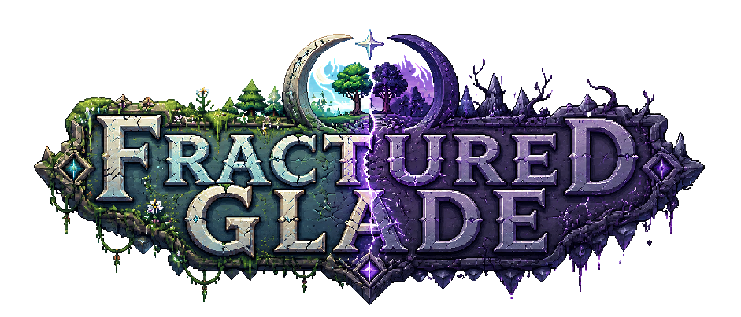

<div align="center">
  
  <h1>Fractured Glade</h1>
  <p><b><i>Руководство по стилю проекта (ﾉ◕ヮ◕)ﾉ*:･ﾟ✧</i></b></p>
  <p align="center">
    <a href="https://git-scm.com/"></a>
    <a href="https://github.com/"></a>
    <a href="https://www.conventionalcommits.org/"></a>
    <a href="https://godotengine.org/"></a>
  </p>
</div>

---

## 1. Общие сведения

### 1.1. Структура сообщения коммита

`<type>(<scope>): <краткое описание>`

### 1.2. Правила оформления

1. Длина заголовка коммита не должна превышать 72 символов
2. Текст коммита на русском языке
3. Все буквы должны быть строчными
4. Вместо буквы `е` в тексте коммита используется буква `е`

---

## 2. Типы коммитов (type)

| Тип        | Назначение                                                              |
| ---------- | ----------------------------------------------------------------------- |
| `feat`     | Новая функциональность (новая фича, компонент)                          |
| `fix`      | Исправление бага                                                        |
| `art`      | Добавление или изменение визуальных/звуковых ресурсов (текстуры, звуки) |
| `balance`  | Изменение игрового баланса (характеристики предметов, врагов и т.п.)    |
| `docs`     | Изменения в документации                                                |
| `chore`    | Рутинные задачи: обновление `.gitignore`, форматирование скрипта и т.п. |
| `local`    | Локализация, перевод текстов                                            |
| `refactor` | Переработка кода без изменения внешнего поведения                       |
| `perf`     | Изменения, направленные на повышение производительности (оптимизация)   |
| `test`     | Добавление или обновление тестов (юнит-, интеграционных)                |

---

## 3. Области (scope)

Области соответствуют основным подсистемам игры. При необходимости можно добавлять новые, но перечисленные ниже - стандартные.

| Область   | Описание                                                                |
| --------- | ----------------------------------------------------------------------- |
| `player`  | Игрок: управление, инвентарь, здоровье, анимации                        |
| `enemies` | Противники, ИИ, анимации                                                |
| `npc`     | Неигровые персонажи, диалоги                                            |
| `assets`  | Добавление новых ресурсов (текстуры, звуки, шрифты)                     |
| `world`   | Мир: тайлы, мировые ивенты,                                             |
| `bioms`   | Макробиомы, биомы и их свойства                                         |
| `gen`     | Процедурная генерация                                                   |
| `rifts`   | Разломы, переход между макробиомами                                     |
| `ui`      | Интерфейс: главное меню, настройки, инвентарь, хотбар, HUD              |
| `items`   | Предметы, ресурсы, инструменты                                          |
| `craft`   | Крафт, рецепты, верстак                                                 |
| `audio`   | Звуки, музыка, микширование                                             |
| `save`    | Сохранение и загрузка (миры, состояние, инвентарь)                      |
| `debug`   | Отладочные инструменты, консоль, читы                                   |
| `core`    | Базовые системные компоненты (главный цикл, менеджеры, Service Locator) |
| `input`   | Управление, привязка клавиш, геймпады                                   |
| `network` | Мультиплеер (архитектура, синхронизация)                                |

---

## 4. Примеры корректных сообщений

- `feat(player): добавлен двойной прыжок`
- `feat(rifts): реализован переход между макробиомами`
- `feat(ui): добавлен хотбар с 10 слотами`
- `fix(gen): исправлена генерация деревьев на поверхности`
- `fix(enemies): слизень теперь наносит урон при касании`
- `balance(items): уменьшен урон медного меча с 12 до 8`
- `refactor(core): менеджеры переведены на autoload`
- `refactor(player): отформатирован скрипт player.gd`
- `art(assets): добавлены текстуры для темного леса`
- `art(assets): добавлен саундтрек для главного меню`
- `docs(style-guide): обновлен список скоупов`
- `chore(git): добавлен workflow для проверки gdscript линтером`
- `test(saving): добавлены юнит-тесты для сериализации мира`

---

## 5. Структура проекта

Проект строится по модульному принципу с четким разделением данных, логики и представления.

```text
fractured-glade/
├── assets/                       # Все немодифицируемые ресурсы
│   ├── textures/                 # Графика
│   │   ├── tiles/                # Тайлы (земля, трава, камень, руды)
│   │   ├── items/                # Иконки предметов
│   │   ├── enemies/              # Спрайты врагов
│   │   ├── npc/                  # Спрайты NPC
│   │   ├── ui/                   # Элементы интерфейса (кнопки, фоны)
│   │   └── effects/              # Визуальные эффекты (частицы, молнии)
│   ├── audio/                    # Звуки и музыка
│   │   ├── music/                # Музыкальные треки (в формате .ogg)
│   │   └── sfx/                  # Звуковые эффекты (шаги, удары, добыча)
│   ├── fonts/                    # Шрифты
│   └── localization/             # Файлы локализации (.po или .csv)
│
├── scenes/                       # Все сцены (.tscn)
│   ├── main_menu/                # Главное меню и настройки
│   ├── game_world/               # Основная игровая сцена (мир + игрок)
│   ├── player/                   # Сцена игрока
│   ├── enemies/                  # Сцены врагов (по одному на тип)
│   ├── npc/                      # Сцены NPC
│   ├── ui/                       # Отдельные UI-сцены (инвентарь, крафт)
│   └── props/                    # Сцены окружающих объектов (дерево, разлом и т.п.)
│       ├── rifts/                # Сцены разломов
│       └── ...                   # Остальные сцены
│
├── scripts/                      # Все GDScript-скрипты (.gd)
│   ├── core/                     # Базовые классы и глобальные менеджеры
│   │   ├── game_manager.gd       # Главный управляющий цикл
│   │   ├── world_manager.gd      # Управление миром и макробиомами
│   │   ├── input_manager.gd      # Обработка ввода
│   │   ├── audio_manager.gd      # Управление звуком
│   │   └── save_manager.gd       # Сохранение/загрузка
│   ├── player/                   # Логика игрока
│   │   ├── player.gd
│   │   └── player_inventory.gd
│   ├── generation/               # Генерация мира, тайлы
│   │   ├── world_generator.gd
│   │   ├── biome_data.gd         # Ресурс-класс для биома
│   │   └── tile_data.gd
│   ├── world/                    # Биомы, мировые ивенты
│   │   └── rifts/                # Логика разломов
│   ├── items/                    # Предметы и инвентарь
│   │   ├── item_base.gd          # Базовый класс предмета
│   │   ├── item_data.gd          # Ресурс с данными предмета
│   │   └── inventory.gd
│   ├── craft/                    # Система крафта
│   │   ├── crafting_manager.gd
│   │   └── recipe_data.gd
│   ├── enemies/                  # Логика врагов
│   │   ├── enemy_base.gd
│   │   └── slime.gd
│   ├── npc/                      # Логика NPC
│   │   ├── npc_base.gd
│   │   └── dialogue_manager.gd
│   ├── ui/                       # Логика интерфейса
│   │   ├── hud.gd
│   │   ├── inventory_ui.gd
│   │   └── crafting_ui.gd
│   └── utils/                    # Утилиты и вспомогательные функции
│       ├── math_utils.gd
│       └── noise.gd              # Генерация шума (если не использовать плагин)
│
├── resources/                    # Ресурсы Godot (.tres, .res) - данные
│   ├── items/                    # Ресурсы предметов (wood.tres, stone.tres, ...)
│   ├── recipes/                  # Ресурсы рецептов (wood_pickaxe.tres, ...)
│   ├── biomes/                   # Данные биомов (light_forest.tres, dark_forest.tres)
│   ├── enemies/                  # Данные врагов (slime.tres)
│   └── npc/                      # Данные NPC (guide.tres)
│
├── tests/                        # Тесты (если будут)
│   ├── unit/                     # Юнит-тесты
│   └── integration/              # Интеграционные тесты
│
├── addons/                       # Сторонние плагины (Godot addons)
│
├── project.godot                 # Файл проекта
├── .gitignore
├── .editorconfig                 # Единые настройки редактора
└── README.md
```

---

## 6. Соглашения по именованию

### 6.1. Файлы и папки

- **Папки** - `snake_case`
  Пример: `game_world/`, `main_menu/`, `audio/`

- **Сцены (файлы .tscn)** - `snake_case`  
  Пример: `player.tscn`, `main_menu.tscn`, `inventory_ui.tscn`

- **Скрипты (файлы .gd)** - `snake_case`
  Пример: `player.gd`, `world_generator.gd`, `save_manager.gd`

- **Ресурсы (файлы .tres, .res)** - `snake_case`  
  Пример: `wood.tres`, `light_forest.tres`, `slime_enemy.tres`

- **Текстуры, звуки и прочие ассеты** - `snake_case`  
  Пример: `grass_tile.png`, `player_walk_01.ogg`

- **Документация** - `kebab-case`
  Пример: `style-guide.md`, `README.md`

### 6.2. Код (GDScript)

- **Классы** - `PascalCase`.
  Пример: `class_name Player extends CharacterBody2D`

- **Константы** - `UPPER_CASE` с подчеркиваниями.  
  Пример: `const MAX_HEALTH = 100`, `const GRAVITY = 980`

- **Переменные** - `snake_case`.  
  Пример: `var current_health`, `var is_moving`

- **Свойства (сеттеры/геттеры)** - `snake_case` (методы тоже).  
  Пример: `func set_health(value):`, `func get_health():`

- **Функции** - `snake_case`.  
  Пример: `func take_damage(amount):`, `func use_item(item):`

- **Сигналы** - `snake_case`, описывают произошедшее действие.  
  Пример: `signal health_changed(new_value)`, `signal item_picked(item_id)`

- **Перечисления** - `PascalCase` для имени, значения в `UPPER_CASE`.  
  Пример:  

  ```gdscript
  enum BiomeType { LIGHT, DARK }
  ```

- **Экспортируемые переменные** - `snake_case` с аннотацией `@export`.  
  Пример: `@export var move_speed: float = 100.0`

### 6.3. Комментарии и документация

- Документировать публичные методы и сложные участки кода с использованием `##` (docstring).  
  Пример:

  ```gdscript
  ## Переключает текущий макробиом.
  ## При переключении обновляется визуальное состояние мира.
  func switch_biome(new_biome: BiomeType) -> void:
      pass
  ```

- Внутренние комментарии на русском языке.

### 6.4. Типизация

- **Стремиться к явной статической типизации**.  
  Пример: `var health: int = 100`, `func damage(amount: int) -> void:`

- Использовать встроенные типы: `int`, `float`, `String`, `bool`, `Vector2`, `Vector3`, `Array`, `Dictionary`, а также кастомные классы.

---

## 7. Git и ветвление

- Основная ветка - `main`.
- Разработка ведется в ветках `feat/<описание>`, `fix/<описание>`, `refactor/<описание>`, `docs/<описание>`.
- Каждый коммит должен быть атомарным (одна логическая единица изменений).
- Перед коммитом обязательно запускать линтер (если настроен) и проверять работоспособность.

---

## 8. Инструменты и настройки

- **Godot 4.x** - последняя стабильная версия.
- **Редактор кода** - VS Code с плагином для GDScript, либо встроенный редактор Godot.
- **Линтер** - [GDScript linting](https://github.com/godotengine/godot-linter) или [gdtoolkit](https://github.com/Scony/godot-gdscript-toolkit) для проверки стиля.
- **EditorConfig** - файл `.editorconfig` для единых настроек отступов (4 пробела) и кодировки.
- **Pre-commit хуки** - можно настроить для автоматического запуска линтера и форматирования.

---

<div align="center">
  
  <br>
  <sub><b>Руководство по стилю проекта</b></sub>
  <br>
  <sup><i>Made with love by <span><a href="https://github.com/PornHapp" target="_blank">MindlessMuse666</a> & <a href="https://github.com/PornHapp" target="_blank">PornHapp Team</a></span></i></sup>
</div>
